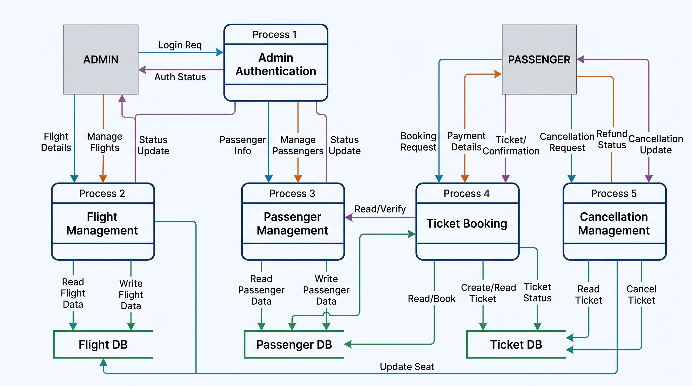

<h2 align="center">Have a look at the Data flow diagram of Airline Management System</h2>
<p align="Center">
  
</p>

# ✈️ Airline Management System

A desktop application built using **C# (.NET Framework)** and **Windows Forms (WinForms)** that streamlines daily operations for airline administrators. It offers a structured workflow to manage flights, passengers, ticket bookings, and cancellations.

---

## 📌 Features

- 🔐 **Admin Authentication & Dashboard**
  - Secure login access for authorized personnel.
  - Interactive main menu dashboard for quick navigation.

- 🛫 **Flight Management**
  - Add new flights with source, destination, seating capacity, and departure dates.
  - View and filter flight details in real time.

- 👤 **Passenger Management**
  - Register passenger details (Name, Passport Number, Nationality, Gender, Phone).
  - View and manage passenger lists.

- 🎫 **Ticket Booking System**
  - Issue tickets to registered passengers.
  - Automatic calculation of ticket prices based on flight selections.

- ❌ **Cancellation Management**
  - Process ticket cancellations efficiently.
  - View records of cancelled bookings.

- 🎨 **User Interface**
  - Clean WinForms interface with a custom splash loading screen.

---

## 🛠️ Tech Stack & Prerequisites

* **Language:** C#
* **Framework:** .NET Framework 4.7.2
* **GUI Engine:** Windows Forms (WinForms)
* **IDE:** Microsoft Visual Studio (2019 / 2022 recommended)
* **Database / Configuration:** Local storage via App.config / ADO.NET Data Services

---

## 📁 Project Structure

```text
AirlineManagement/
├── AdminPanel.cs              # Admin panel interface
├── AddPassengers.cs           # Passenger registration module
├── ViewPassengers.cs          # Passenger details viewer
├── Flight.cs                  # Flight creation form
├── ViewFlights.cs             # Flight schedule and lookup module
├── Tickets.cs                 # Ticket booking engine
├── Cancellation.cs            # Ticket cancellation handler
├── Login.cs                   # User authentication screen
├── MainMenu.cs                # Central control dashboard
├── Splash.cs                 # Initial splash/loading screen
├── Program.cs                 # Application entry point
├── App.config                 # Configuration settings
└── Airline Management System.csproj
